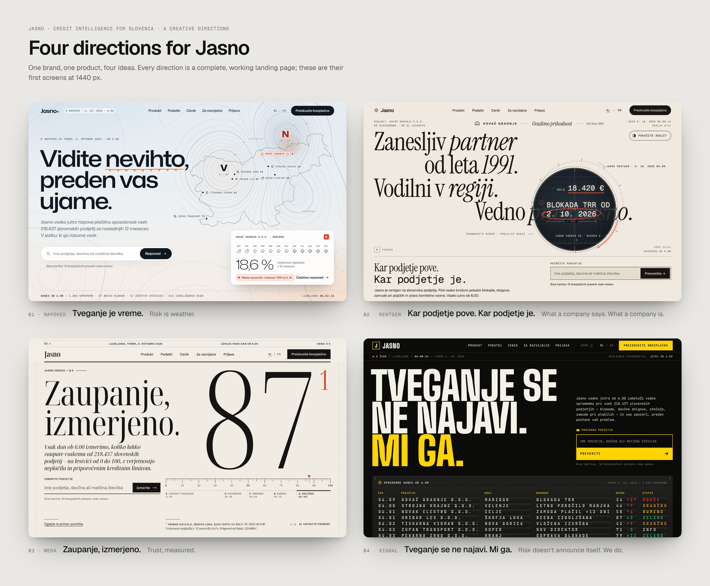

# Jasno: four landing-page directions

A standalone design project: four complete, working landing pages for **Jasno**, a new Slovenian
credit-intelligence brand built to compete with EBONITETE.SI (Prva bonitetna agencija d.o.o.).
Each direction is a real static site (HTML/CSS/JS, no build step). Screenshots are produced with Playwright.

> All companies, people, quotes and figures on the pages are fictional placeholders. "Jasno" is a working name;
> it still needs a trademark and domain check.

## The brief in one paragraph

EBONITETE.SI rates companies 1–10, mostly from annual accounts that can be up to 18 months old. It is sold through
sales calls and wrapped in a generic corporate look. Jasno's promise is simpler and sharper: **every morning at 6.00 it
tells you whether a company will pay you.** It covers every Slovenian company, explains the answer in plain Slovenian,
and recommends a credit limit and a payment term. The core insight behind all four directions:
**"Vsak račun je posojilo."** Every invoice with payment terms is a loan, so for those 60 days you are a bank,
without a bank's data.

## Four directions

| # | Direction | Idea | Signature moment | Look |
|---|---|---|---|---|
| 01 | **Napoved** (The Forecast) | *Tveganje je vreme.* Credit risk is weather, so Jasno publishes a 12-month payment forecast for every company. The name is the idea: *jasno* is the forecast word for a clear sky. | A WebGL isobar map of Slovenia; the cursor is a low-pressure system that bends the isobars. Alerts follow the Meteoalarm green/yellow/orange/red levels, each with an action. | Dawn sky, synoptic cartography, Mona Sans + IBM Plex Mono |
| 02 | **Rentgen** (The X-ray) | *Kar podjetje pove. Kar podjetje je.* Every company has a facade and a skeleton. | An X-ray lens over glossy serif marketing claims reveals the data beneath. Scrolling expands the lens into a radiograph world, and the report is a radiology *izvid*. | Cream facade → film black; Instrument Serif vs Geist Mono |
| 03 | **Mera** (The Measure) | *Zaupanje, izmerjeno.* Trust finally gets a unit, presented like a standard. | Monumental condensed numerals on an odometer, precision rulers with a vermilion marker, and the "365 : 1" spread. | A typeset financial journal: Noto Serif Display + Schibsted Grotesk |
| 04 | **Signal** (The Departure Board) | *Tveganje se ne najavi. Mi ga.* The economy as a live departures board. | A split-flap board of this morning's company events. Pricing appears as train tickets, and a countdown runs to the next 6.00 update. | Black, signal yellow, Big Shoulders Display + JetBrains Mono |

Briefs: [`BRIEF.md`](BRIEF.md) (shared: brand, product facts, copy rules, engineering, award gate) and `0X-*/BRIEF.md`
(per-direction storyboard, palette, type and motion spec).



## Recommendation: 01 Napoved

**Ship Napoved.** It is the only direction where the idea and the name are the same thing: *jasno* is what a forecaster
says about a clear sky. That makes the brand self-explaining.

- **It explains the product.** "18,6 % chance of a storm in the next 12 months" is a probability of default that a bakery
  owner understands without a glossary.
- **It scales beyond the landing page.** Alerts become storm warnings with actions (green/yellow/orange/red). The monthly
  *Gospodarska vremenska karta* (economic weather map) is a ready-made PR and newsletter engine, and the cold and warm fronts give
  the product a visual grammar for change.
- **It is warm, not fearful.** Competitors sell risk with shields and red flags. Napoved ends on a sunrise: "Jutri ob 6.00 bo jasno."

**Runner-up: 02 Rentgen.** It has the single strongest interaction, and its *izvid* is the clearest report design of the
four. It positions Jasno as a challenger that exposes companies, which is bolder but colder. Rated companies may read it as
hostile, and banks may read it as provocative. If the business wants a louder launch, Rentgen is the one to take.

## Award audit (jury simulation)

Weighted the way Awwwards weights it: design 40 %, usability 30 %, creativity 20 %, content 10 %.

| Direction | Design | Usability | Creativity | Content | Weighted | What would cost points | Fix before launch |
|---|---|---|---|---|---|---|---|
| 01 Napoved | 8.8 | 8.6 | 9.2 | 8.8 | **8.82** | The WebGL hero has not yet been profiled on a mid-range Android. At 1024–1366 px one station label is dropped to avoid copy. | Real-device profiling. Add a static first frame as a poster image for LCP and hydrate the shader after idle. |
| 03 Mera | 9.0 | 8.7 | 8.4 | 9.0 | 8.79 | The editorial-serif look is familiar to jurors, and the interaction is the quietest of the four. | Add one bolder kinetic moment, such as a ruler that measures the visitor's own partner live. |
| 02 Rentgen | 8.9 | 8.2 | 9.3 | 8.6 | 8.74 | `mask-image` updates repaint and are not compositor-only. Long dark sections and an adversarial tone. | Throttle lens updates on low-power devices (or move the lens to WebGL). Keep the positive bookend. |
| 04 Signal | 8.5 | 8.4 | 8.7 | 8.8 | 8.54 | Split-flap is a known trope. The loud palette undercuts trust for banks. The 3-line H1 pushes the board down. | Two-line H1 at ≥1440. A quieter variant for enterprise sales pages. |

Lighthouse has not been run yet: these are static builds without a CDN. Run it in CI against the production build
(budgets: LCP ≤ 2.5 s, INP ≤ 200 ms, CLS ≤ 0.1, mobile score 90+).

## Screens

| | Overview board | Full page (desktop 1440) |
|---|---|---|
| 01 Napoved | [board](screens/boards/01-napoved-board.jpg) | [desktop-full.jpg](screens/01-napoved/desktop-full.jpg) |
| 02 Rentgen | [board](screens/boards/02-rentgen-board.jpg) | [desktop-full.jpg](screens/02-rentgen/desktop-full.jpg) |
| 03 Mera | [board](screens/boards/03-mera-board.jpg) | [desktop-full.jpg](screens/03-mera/desktop-full.jpg) |
| 04 Signal | [board](screens/boards/04-signal-board.jpg) | [desktop-full.jpg](screens/04-signal/desktop-full.jpg) |

High-resolution full pages (`desktop-full@2x.jpg`), mobile full pages and hero shots are produced by `npm run capture:all`.
They are not committed, to keep the repository light.

## Layout

```
jasno/
  BRIEF.md                 shared creative + engineering brief
  01-napoved/ 02-rentgen/ 03-mera/ 04-signal/
      BRIEF.md             direction storyboard
      index.html styles.css main.js   (01 adds isobars.js + maps.js; 03 adds og.png)
  shared/
      fonts/               self-hosted OFL fonts (latin + latin-ext) with @font-face CSS per family
      vendor/              GSAP 3.15 (+ ScrollTrigger, SplitText, CustomEase, ScrambleText), Lenis 1.3
      geo/                 Slovenia outline, 12 regions and dot grid (Natural Earth 1:10m, public domain)
  tools/
      capture.mjs          Playwright screenshots (desktop 1440 @2x, mobile 390 @3x/@2x, review slices)
      boards.mjs           presentation boards from the captures
      build-geo.mjs        regenerates shared/geo from world-atlas
      fetch-fonts.py       regenerates shared/fonts from Google Fonts
  screens/                 the delivered images
```

## Run

```sh
cd jasno
npm run serve                 # http://localhost:5173/01-napoved/ (…02-rentgen, 03-mera, 04-signal)
npm run capture -- 01-napoved # screenshots → screens/01-napoved/
npm run capture:all           # all four
node tools/boards.mjs         # presentation boards → screens/boards/
```

Pages must be served over HTTP; fonts do not load from `file://`. Add `?capture=1` to any URL to see the static,
fully revealed state used for screenshots.

## Engineering notes

- **Stack:** plain HTML/CSS/JS with no build step, so each direction can be judged on its own. For production, port the chosen
  direction to Astro (static-first, island hydration for the signature component) with a headless CMS (Sanity or
  Storyblok) for copy, pricing and quotes, deployed on an edge host with preview deploys.
- **Motion:** GSAP + ScrollTrigger for choreography and Lenis for smooth scroll (off under reduced motion). Signature
  visuals use raw WebGL (Napoved), CSS masks (Rentgen), SVG and odometer DOM (Mera) or CSS 3D flaps (Signal). All of them
  animate transform and opacity, pause off-screen, and have static fallbacks.
- **Accessibility:** semantic landmarks, one `h1`, a skip link, visible focus, a full reduced-motion experience, and
  text equivalents for every visual. The X-ray has a keyboard toggle and the departure board is a real table with a pause control.
- **Capture mode:** `?capture=1` renders every section in its final state, with deterministic generative frames and no pinning,
  so a full-page screenshot shows the composed page.
